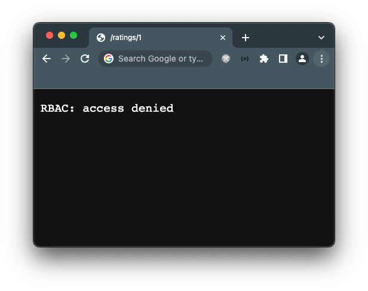

# Authn & Authz with Istio


- Istio를 통해 인증/인가하는 방법에 대한 데모입니다.
- Istio의 RequestAuthentication, AuthorizationPolicy, AWS의 Cognito, EKS 등을 이용합니다.
- 메쉬의 워크로드들은 각자의 Istio sidecar를 통해 각자가 인증/인가를 수행합니다.
- Istio측에서 제공하는 example 중 하나인 [bookinfo](https://istio.io/latest/docs/examples/bookinfo/)를 바탕으로 합니다.
- 본 데모를 통해 만족시켜야하는 가상의 요구사항
  - 일반 유저들은 product page를 통해 bookinfo 서비스를 이용할 수 있도록 한다.
  - 일반 유저들은 뒷단의 API 서버들에 대한 접근이 불가능하도록 한다.
  - 개발자 계정을 통해서는 직접 뒷단의 API 서버를 호출도 가능하다. 
 
## Requirements

| 종류               | 설명                                                  |
|--------------------|-----------------------------------------------------|
| K8s cluster | e.g. EKS, minikube                                  |
| Istio |                                                     |
| Cert manager | HTTPS를 위한 인증서 발급을 위함. HTTP만으로도 데모를 마칠 수 있을지 확실하지 않음. |

## 사전 안내
 
- 데모를 진행할 때에는 현재 작업하는 k8s context와 namespace가 무엇인지 한 번 더 확인한 뒤 진행합니다.
- 도메인 네임 등 자신의 환경에 맞게 수정해야하는 값들이 있습니다. 혹은 Istio가 셋팅된 환경에 따라 namespace 등을
  변경해줘야할 수 있습니다.
  따라서 본 레포를 포크 혹은 클론한 뒤 수정해서 진행하실 것을 권장합니다.
- SaaS 인증 서비스들은 대부분 Callback URL을 HTTP가 아닌 HTTPS로 강제하는 경우들이 있습니다.
  본 데모는 [cert-manager](https://cert-manager.io/docs/)를 통해 HTTPS를 위한 인증서 발급받습니다.

## 데모 진행

### 0. Requirements를 위한 짧은 가이드

- K8s cluster을 위한 EKS 생성 (자세한 내용은 [AWS 가이드](https://docs.aws.amazon.com/ko_kr/eks/latest/userguide/getting-started-eksctl.html) 추천)
  ```
  $ brew install eksctl
  
  # AWS Credential 설정 후 eksctl로 EKS 클러스터 생성
  $ eksctl create cluster --name my-cluster --region ap-norhteast-2
  ```
- Istio 설치 -> [Istio 가이드](https://istio.io/latest/docs/setup/install/helm/) 참고
- cert-manager 설치 및 권한 설정 -> 다음 자료들 참고
  - [Cert manager의 설치 가이드](https://cert-manager.io/docs/installation/helm/)
  - [Route53 사용을 위한 설정 가이드](https://cert-manager.io/docs/configuration/acme/dns01/route53/)
  - [본인이 특정 도메인 네임의 소유주임을 증명하는 방법 관련 가이드](https://cert-manager.io/docs/configuration/acme/dns01/)

### 1. `./base`를 바탕으로 bookinfo를 배포하기

도메인 네임 등 수정해야하는 값들을 수정한 뒤 kubectl, kustomize를 통해 bookinfo 서비스를 배포합니다. 

```shell
kubectl apply -k ./base
```

잘 적용됐는지 확인해봅니다. Certificate의 READY=True면 인증서가 잘 발급된 것입니다.

```shell
$ kubectl get cert -A -l domain=bookinfo

NAMESPACE       NAME       READY   SECRET
istio-ingress   bookinfo   True    bookinfo
```

Pod가 모두 Running 중이어야합니다.

```shell
$ kubectl get pod

NAME                              READY   STATUS    RESTARTS
details-v1-6d68dd7666-6895g       2/2     Running   0
httpbin-566788c95f-ljvdt          2/2     Running   0
productpage-v1-796458f675-zsfpl   2/2     Running   0
ratings-v1-5b6b89798-mng7z        2/2     Running   0
reviews-v3-595548bcf9-n72wj       2/2     Running   0
```

그럼 자신이 설정했던 도메인에 접속해봅니다. bookinfo 페이지를 볼 수 있어야합니다.


### 2. 인증 서비스 설정하기

AWS Cognito, Auth0, Keycloak 등의 OAuth2/OIDC를 제공하는 인증 서비스에서 클라이언트를 생성하고
적절히 설정해줍니다.

대체로 다음과 같은 유사한 설정/기능들이 존재합니다.

- Authorization code를 이용하는 인증 방식
- Client ID, Client Secret을 제공해줌
- 사용할 Callback URL을 정의함.

잘 설정했으면 계속해서 프론트엔드에서 인증 서비스로 안내해주기 위한 작업을 수행합니다.

### 3. OAuth2 Porxy 배포하기

보통은 프론트엔드에서 직접 인증 서비스를 호출할 수 있도록 개발하겠으나, 데모인 관계로 간단히 [OAuth2 proxy](https://github.com/oauth2-proxy/oauth2-proxy)라는
도구를 이용하겠습니다. OAuth2 proxy는 애플리케이션 서버들보다 앞단에서 유저에게 인증을 요구할 수 있게 해줍니다.

`./oauth2proxy/oauth2proxy.env` 파일을 만들어 OAuth2 proxy가 올바르게 Cognito 등의 OIDC 서비스를 바라보기 위해 필요한 환경변수를 정의합니다.
이 파일에서 정의한 환경변수는 kustomize를 통해 컨테이너의 환경변수로 적용됩니다.

```env
BOOKINFO_OIDC_ISSUER_URL=<https://cognito-idp.ap-northeast-2.amazonaws.com/자신의 Cognito user pool ID로 수정>
BOOKINFO_REDIRECT_URL=<htts://자신의 도메인/oauth2/callback의 형태>
BOOKINFO_CLIENT_ID=<Cognito의 client app 등의 id>
BOOKINFO_CLIENT_SECRET=<Cognito의 client app 등에서 부여받은 시크릿>
```

배포합니다.

```shell
$ kubectl apply -k ./oauth2proxy
```

배포가 잘 됐다면 oauth2proxy Pod도 잘 떴을 겁니다.
```shell
$ kubectl get pod

NAME                              READY   STATUS    RESTARTS
details-v1-6d68dd7666-6895g       2/2     Running   0
httpbin-566788c95f-ljvdt          2/2     Running   0
oauth2proxy-547f9d99cc-dxlr4      2/2     Running   0
productpage-v1-796458f675-zsfpl   2/2     Running   0
ratings-v1-5b6b89798-mng7z        2/2     Running   0
reviews-v3-595548bcf9-n72wj       2/2     Running   0
```

🎉 그럼 아까와 같은 URL로 접속 시 이런 로그인 창을 볼 수 있을 것입니다. OAuth2 Proxy가 인증되지 않은
사용자를 자동으로 Cognito에서 설정해뒀던 로그인 페이지로 안내해준 것입니다.
(직접 로그인 페이지를 운영하진 않았고 Cognito가 호스팅해준 페이지를 이용했습니다.)


간단히 약간의 CSS 수정도 가능합니다.


### 4. Istio를 통해 인가 설정하기

Istio를 통해 다음과 같은 권한 체계를 적용해보겠습니다.

- 일반 유저: `permission: public` 라벨이 붙은 서비스에만 접근이 가능합니다. (e.g. product page)
- 개발자: `permission: developer` 라벨이 붙은 서비스에도 접근이 가능합니다. (e.g. details API, ratings API, reviews API)

_(httpbin 서비스의 경우 디버깅 목적 등으로 배포된 서비스이고 데모라는 점에서 permission: public으로 설정함.)_

필요한 몇가지 Istio의 커스텀 리소스들을 `./authorization/authorization.yaml`에 작성해줄 것입니다.

우선 Istio가 요청자의 신원을 파악(인증)할 수 있도록 `RequestAuthentication`이라는 커스텀 리소스를 작성해줍니다.
```yaml
apiVersion: security.istio.io/v1
kind: RequestAuthentication
metadata:
  name: authn
  namespace: bookinfo
spec:
  jwtRules:
    - issuer: <https://cognito-idp.ap-northeast-2.amazonaws.com/자신의 Cognito user pool ID로 변경>
      jwksUri: <https://cognito-idp.ap-northeast-2.amazonaws.com/자신의 Cognito user pool ID로 변경/.well-known/jwks.json>
      # OAuth2 Proxy가 JWT 토큰을 넘겨주는 default header는 `X-Forwarded-Access-Token`입니다.
      # Istio는 이 JWT 토큰을 해석해 사용자의 신원을 파악합니다.
      fromHeaders:
        - name: X-Forwarded-Access-Token
      forwardOriginalToken: true
```

인증된 사용자 정보를 인가에 활용합니다.
developer 그룹에 속하지 않은 유저가 `permission: developer`인 워크로드들에게 직접 접근하는 것은 Deny합니다.
일반 유저들은 product page 서비스를 거쳐 내부적으로만 해당 API 서비스들을 호출하는 것이 이번 데모에 대한 가상의 요구사항이기  상황이기 때문입니다.

```yaml
apiVersion: security.istio.io/v1
kind: AuthorizationPolicy
metadata:
  name: developers-only
  namespace: bookinfo
spec:
  selector:
    matchLabels:
      permission: developer
  action: DENY
  rules:
    - from:
        - source:
            notNamespaces: [bookinfo]
      when:
        - key: request.auth.claims[cognito:groups]
          notValues: [developer]
```

`./authorization/authorization.yaml` 파일 작성이 모두 끝났으면 적용해줍니다.

```shell
$ kubectl apply -f ./authorization
```

이제 developer 그룹에 속하지 않은 일반 유저는 API를 직접 호출할 수는 없습니다.



반면 developer 그룹의 유저는 이렇게 API를 직접 호출할 수 있습니다.


## 주의사항과 팁

- RequestAuthentication이나 AuthorizationPolicy가 잔재되어있는 경우에는 예상치 못하게 잔재된 리소스의
  설정대로 동작할 수 있으니 사용하지 않는 리소스는 잘 삭제한 뒤 진행합니다.
- URL 뒤에 `/`가 존재하는지, 존재하지 않는지, `.well-known/openid-configuration` 같은 sub path를 입력하는지 마는지 등의 사소한 차이로
  동작하지 않을 수 있으니 주의합니다.
- AuthorizationPolicy가 존재하지 않을 때는 authz가 모두 허용되지만 ALLOW가 존재하게 되는 순간 Whitelist 방식으로 ALLOW하는 형태가 될 수 있습니다.
  따라서 라이브 중인 클러스터에 AuthorizationPolicy를 적용할 때는 namespace, selector를 올바르게 정의했는지를 잘 확인합니다.
- OAuth2 proxy와 Istio sidecar을 거쳐 최종적으로 애플리케이션 서버 컨테이너에 어떤 HTTP Header가 전달되는지 좀 더 정확히 확인해볼 수 있도록 [Httpbin](https://httpbin.org/)을 배포합니다.
  `GET /headers`등의 요청을 활용할 수 있습니다. 
- Cognito나 Auth0등의 SaaS형 IdP(Identity Provider) 서비스들은 Callback URL로 HTTP가 아닌 HTTPS를 사용하도록 강제하는
  경우가 많습니다. 따라서 x509 인증서가 필요할 수 있고, cert-manager가 사용 가능한 k8s 환경이라면 cert-manager로 이런 인증서를 발급 받을 수 있습니다.
  하지만 cert-manager가 없는 환경에서 데모를 진행해보고 싶다면 openssl 커맨드를 이용해볼 수도 있습니다.
  - 간단히 설명하자면, self-signed CA Certificate를 발급받고 로컬 머신에 해당 CA certificate를 설치합니다.
    추가적으로 해당 CA로 원하는 도메인에 대한 leaf certificate를 발급합니다. leaf의 certificate, private key 등을 istio ingressgateway가 배포된 namespace에 secret으로 생성합니다.
    Istio의 Gateway CustomResource가 해당 secret을 credential로 사용하도록 합니다. 이후 원하는 도메인을 127.0.0.1로 resolve하는 내용을 `/etc/hosts` 등에 기입합니다.
    istio의 ingressgateway의 https 포트에 포트포워딩하고 인증서를 발급받았던 도메인으로 접속합니다.
  - ... 등등..
  - 필요한 Openssl 커맨드는 ChatGPT에게 물어보면 잘 알려줍니다.
- 데모에 사용된 bookinfo.ausg.jinsu.me 도메인은 불시에 접속이 제한됩니다.
